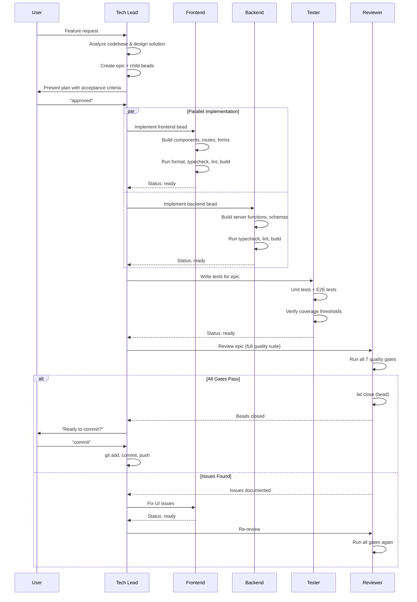

# The Agent Team

Vamsa's development is driven by five specialized Claude Code agents, each with a distinct role, model selection, toolset, and permission boundaries. This page documents each agent and the rules that govern how they work together.

## Agent Summary

| Agent | Model | Color | Permission Mode | Primary Role |
|---|---|---|---|---|
| **Tech Lead** | Opus | Purple | `acceptEdits` | Central coordinator -- never implements |
| **Backend** | Haiku | Blue | `acceptEdits` | Server functions, schemas, database |
| **Frontend** | Sonnet | Green | `acceptEdits` | React components, pages, forms |
| **Tester** | Sonnet | Yellow | `acceptEdits` | Unit and E2E tests |
| **Reviewer** | Opus | Red | `bypassPermissions` | Quality gatekeeper -- only agent that closes beads |

---

## Tech Lead

**Config file:** `.claude/agents/techlead.md`

The Tech Lead is the central coordinator for all development work. It analyzes feature requests, designs solutions, creates beads, and orchestrates the other four agents. It never implements code directly -- it always delegates.

### Capabilities

| Property | Value |
|---|---|
| **Model** | Opus (highest capability -- needed for architectural reasoning) |
| **Tools** | Read, Write, Edit, Bash, Glob, Grep, WebSearch, WebFetch, Task |
| **Temperature** | 0.2 |

The Tech Lead is the only agent with access to the **Task** tool, which allows it to spawn sub-agents. It also has **WebSearch** and **WebFetch** for researching best practices and external APIs.

### Workflow

1. **Analyze** the feature request and explore the codebase for existing patterns
2. **Design** a solution following established conventions
3. **Create beads** -- an epic (parent) with frontend and backend child beads, each with acceptance criteria
4. **Present the plan** to the user and wait for explicit "approved" response
5. **Orchestrate** agents: invoke frontend and backend in parallel, then tester, then reviewer
6. **Coordinate** issue resolution when the reviewer finds problems
7. **Commit** code after all beads are closed and the user approves

### Parallel Task Decomposition

The Tech Lead always evaluates whether work can be parallelized before delegating. Common patterns include:

- **Multiple testers** for coverage work across many files
- **Frontend + backend simultaneously** when they do not share files
- **Unit tests + E2E tests** as separate parallel workstreams
- **Multiple reviewers** for independent features

!!! tip "Parallelization Decision"
    If a task is estimated at more than 15 minutes and can be split into independent parts with no shared files, the Tech Lead launches multiple agents in a single message for simultaneous execution.

### Restrictions

- Cannot close beads (only the reviewer can)
- Cannot implement code directly (must delegate)
- Must wait for user approval before starting implementation

---

## Backend

**Config file:** `.claude/agents/backend.md`

The Backend agent handles all server-side implementation: TanStack Start server functions, Zod validation schemas, Drizzle database migrations, and API logic.

### Capabilities

| Property | Value |
|---|---|
| **Model** | Haiku (fast, cost-effective for structured backend work) |
| **Tools** | Read, Write, Edit, Bash, Glob, Grep |
| **Temperature** | 0.2 |

### What It Builds

- **Server functions** in `apps/web/src/server/` with `"use server"` directives
- **Zod schemas** in `packages/schemas/src/` for input validation
- **Database changes** in `packages/api/src/drizzle/schema/` with Drizzle migrations
- **Business logic** in `packages/lib/src/server/business/`

### Quality Gates

Before reporting ready, the backend agent runs:

```bash
bun run typecheck   # TypeScript compilation
bun run lint        # ESLint validation
bun run build       # Production build
```

### Key Patterns

The backend agent follows the **dependency injection pattern** for all business logic:

```typescript
// Dependencies are parameters with defaults -- testable without module mocking
export async function getNotificationPreferences(
  userId: string,
  db = drizzleDb  // Accepts mock in tests, uses real db in production
) {
  return db.query.users.findFirst({ where: eq(users.id, userId) });
}
```

### Restrictions

- Cannot close beads
- Cannot commit to git
- Must validate all input with Zod
- Must include auth checks first in every server function

---

## Frontend

**Config file:** `.claude/agents/frontend.md`

The Frontend agent implements the user interface: React components, TanStack Start routes, forms, and client-side interactivity. It follows Vamsa's editorial + earth tones design system.

### Capabilities

| Property | Value |
|---|---|
| **Model** | Sonnet (creative capability for UI work) |
| **Tools** | Read, Write, Edit, Bash, Glob, Grep |
| **Temperature** | 0.3 (slightly higher for creative UI decisions) |

### Design System Awareness

Before writing any UI code, the frontend agent reads the design skill files:

- `.claude/skills/design/SKILL.md` -- Core design philosophy
- `.claude/skills/design/tokens.md` -- Color, typography, and spacing tokens
- `.claude/skills/design/patterns.md` -- Component patterns and compositions

!!! info "Design Principles"
    Vamsa's design is **Professional + Minimalistic + Organic**: clean interfaces with earth tones (forest greens, warm creams), Fraunces display type, Source Sans 3 body type, and subtle 200-300ms transitions. WCAG 2.1 AA compliance is required.

### What It Builds

- **Routes** in `apps/web/src/routes/` using TanStack Start file-based routing
- **Components** in `packages/ui/src/` following shadcn/ui patterns
- **Forms** using react-hook-form + Zod + TanStack Query
- **Client interactivity** using `"use client"` directives only when needed

### Quality Gates

```bash
bun run format      # Prettier formatting
bun run typecheck   # TypeScript compilation
bun run lint        # ESLint validation
bun run build       # Production build
```

### Restrictions

- Cannot close beads
- Cannot commit to git
- Server components by default (client components only when state or interactivity is needed)

---

## Tester

**Config file:** `.claude/agents/tester.md`

The Tester agent writes comprehensive test suites and verifies coverage thresholds. It focuses exclusively on testing -- it never modifies production code or commits to git.

### Capabilities

| Property | Value |
|---|---|
| **Model** | Sonnet (fast for test generation) |
| **Tools** | Read, Write, Edit, Bash, Glob, Grep |
| **Temperature** | 0.2 |

### What It Produces

=== "Unit Tests (Vitest)"

    Located in `src/**/*.test.{ts,tsx}`, unit tests cover:

    - Server function behavior
    - Zod schema validation (valid and invalid cases)
    - Business logic with dependency injection
    - React component rendering

=== "E2E Tests (Playwright)"

    Located in `apps/web/e2e/**/*.e2e.ts`, E2E tests cover:

    - Complete user workflows using BDD structure (Given-When-Then)
    - Page Object Model for maintainability
    - Test IDs (`getByTestId()`) instead of brittle CSS selectors
    - Strict timeouts: 5s page load, 3s interactions

### Coverage Thresholds

| Metric | Minimum |
|---|---|
| Statements | 90% |
| Branches | 85% |
| Functions | 90% |
| Lines | 90% |

### Restrictions

- **Never commits to git** -- not the tester's responsibility
- **Never modifies non-test code** -- only edits test files
- **Never marks beads complete** -- only the reviewer can close beads
- **Never uses git commands** -- focuses exclusively on testing

---

## Reviewer

**Config file:** `.claude/agents/reviewer.md`

The Reviewer is the quality gatekeeper and the **only agent authorized to close beads**. It runs the full quality suite, verifies acceptance criteria, and either closes the bead (all pass) or documents issues for the responsible agent to fix.

### Capabilities

| Property | Value |
|---|---|
| **Model** | Opus (needs judgment for quality assessment) |
| **Tools** | Read, Bash, Glob, Grep (read-only + bash -- cannot edit files) |
| **Temperature** | 0.1 (lowest -- precise, deterministic) |
| **Permission Mode** | `bypassPermissions` (can run any command including Docker) |

!!! warning "Unique Authority"
    The Reviewer is the only agent that can execute `bd close`. This is a governance decision, not a limitation. It prevents premature closure and ensures every quality gate runs before work is marked complete.

### The Full Quality Suite

The reviewer must run **all seven gates** -- no exceptions:

| Gate | Command | Purpose |
|---|---|---|
| Unit Tests | `bun run test` | All tests pass |
| Lint | `bun run lint` | No style violations |
| TypeScript | `bun run typecheck` | No type errors |
| Build | `bun run build` | Production build succeeds |
| Dev Server | `bun run dev` + curl | Server starts and responds |
| Docker Build | `docker build` | Container image builds |
| Docker Run | `docker run` + curl | Container runs and app responds |

### Issue Resolution

When gates fail, the reviewer:

1. Documents all issues clearly in bead comments
2. Identifies the responsible agent (frontend, backend, or tester)
3. Reports issues with assignment recommendations
4. Does **not** close the bead
5. Requests the Tech Lead to reassign

The Tech Lead then re-invokes the responsible agent, who fixes the issues and reports ready. The reviewer runs the full suite again. This loop continues until all gates pass.

---

## Feature Delivery Sequence

The following diagram shows how a feature flows through the agent team from request to shipped code:



## Governance Rules

These five rules are enforced by design across all agents:

### 1. Only the Reviewer Closes Beads

No other agent can execute `bd close`. This prevents premature closure and ensures the full quality suite runs before any work is marked complete.

### 2. Agents Report "Ready," Not "Complete"

Implementation agents (frontend, backend, tester) update their bead status to `ready` and post a comment with quality gate results. The word "complete" is reserved for the reviewer's final approval.

### 3. Only the Tech Lead Commits Code

No other agent uses git commands. The Tech Lead commits after the reviewer has closed all beads and the user has approved the commit.

### 4. Frontend and Backend Work in Parallel

The Tech Lead invokes both agents simultaneously. They work on independent files and report ready independently. The tester only starts after both are ready.

### 5. Quality Gates Run Sequentially

Testing happens after implementation, and review happens after testing. This ensures the reviewer validates the complete picture -- implementation plus tests together.

## Next Steps

- **[Beads Workflow](beads-workflow.md)** -- How beads track tasks through the agent pipeline
- **[Development Loops](development-loops.md)** -- Autonomous loops that drive the agent team
- **[Quality Gates](quality-gates.md)** -- Deep dive into the review process and governance model
