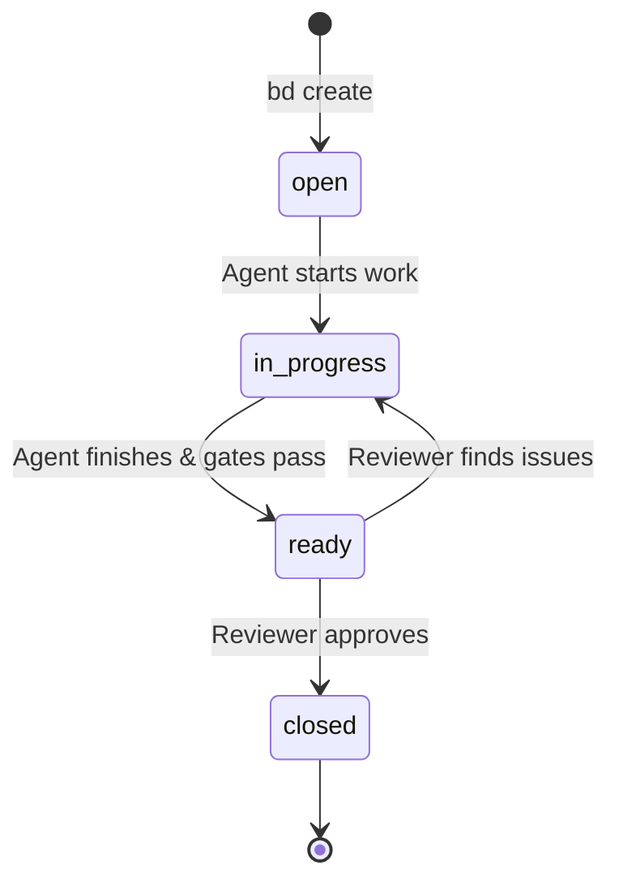

# Task Management with Beads

Beads are Vamsa's local-first task management system -- like GitHub Issues, but CLI-driven and designed for agentic workflows. Every feature, bug fix, and improvement is tracked as a bead with a clear lifecycle, priority, and ownership.

## What Are Beads?

A bead is a unit of work with:

- A **unique ID** (e.g., `vamsa-dc2`, `vamsa-8y0`)
- A **type** (epic, task, frontend, backend)
- A **status** that tracks progress through the agent pipeline
- **Acceptance criteria** that define when the work is done
- Optional **parent/child relationships** for hierarchical decomposition
- Optional **dependencies** on other beads

Beads live in the `.beads/` directory and are synced with git via `bd sync`. They are the contract between agents: the Tech Lead creates them, implementation agents work on them, the tester verifies them, and the reviewer closes them.

## The `bd` CLI Tool

All bead operations use the `bd` command-line tool. Here are the essential commands:

### Creating Beads

```bash
# Create a simple task
bd create "Fix login validation error" -t task -p 2

# Create an epic (parent bead for a feature)
bd create "Epic: Email Notifications" --type epic --priority 1

# Create a child bead under an epic
bd create "Frontend: Notification Preferences UI" --type frontend --priority 2 --parent vamsa-abc
bd create "Backend: Email Service" --type backend --priority 2 --parent vamsa-abc
```

### Viewing Beads

```bash
# View details of a specific bead
bd show vamsa-abc

# List beads that are ready to work on (unblocked)
bd ready

# List all beads with a filter
bd list --status=open
bd list --filter "Port"
```

### Updating Beads

```bash
# Mark a bead as in progress
bd update vamsa-abc --status in_progress

# Mark a bead as ready for review
bd status vamsa-abc ready

# Assign a bead to an agent
bd assign vamsa-abc @backend

# Add a comment
bd comment vamsa-abc --body "Backend implementation complete. Quality gates passed: typecheck, lint, build."

# Close a bead (reviewer only)
bd close vamsa-abc --reason "All criteria met. All 7 quality gates passed."
```

### Syncing with Git

```bash
# Sync bead state with git (updates .beads/ directory)
bd sync
```

## Bead Lifecycle

Every bead moves through four states:



| Status | Meaning | Who Sets It |
|---|---|---|
| `open` | Created but not yet started | Tech Lead (via `bd create`) |
| `in_progress` | An agent is actively working on it | Any implementation agent |
| `ready` | Work is done, quality gates passed, awaiting review | Frontend, Backend, or Tester |
| `closed` | Reviewer verified all gates pass | Reviewer only |

!!! warning "Only the Reviewer Closes Beads"
    The `closed` status is reserved for the Reviewer agent. No other agent should execute `bd close`. This is a governance rule that ensures every piece of work passes the full quality suite before being marked done.

## Epic + Child Bead Pattern

Features are decomposed into a hierarchy: one **epic** (parent) with one or more **child beads** for specific implementation work.

### Example: Adding Email Notifications

```bash
# Step 1: Create the epic
bd create "Epic: Email Notifications" --type epic --priority 1
# Output: Created vamsa-epic-123

# Step 2: Create child beads
bd create "Frontend: Notification Preferences UI" \
  --type frontend --priority 2 --parent vamsa-epic-123

bd create "Backend: Email Service + Templates" \
  --type backend --priority 2 --parent vamsa-epic-123

# Step 3: Enrich each bead with acceptance criteria
bd update vamsa-frontend-124 --description "$(cat <<'EOF'
## Acceptance Criteria
- [ ] Settings page has notification toggle
- [ ] User can enable/disable email notifications
- [ ] Toggle state persists across page reloads
- [ ] Toast confirmation on save

## Files to Modify
- apps/web/src/routes/settings/notifications.tsx
- packages/ui/src/components/notification-toggle.tsx
EOF
)"
```

The resulting structure:

```
vamsa-epic-123 (Epic: Email Notifications)
  ├── vamsa-frontend-124 (Frontend: Preferences UI)
  └── vamsa-backend-125 (Backend: Email Service)
```

## Priority System

Beads use a five-level priority system. The Tech Lead and the bead loop process beads in priority order.

| Priority | Label | Description | Examples |
|---|---|---|---|
| **P0** | Critical | Blockers, production issues | App crash, data loss, security vulnerability |
| **P1** | High | Core functionality | Login, data creation, essential user flows |
| **P2** | Medium | Important features | Settings pages, export, notifications |
| **P3** | Low | Nice-to-haves | UI polish, performance tuning |
| **P4** | Backlog | Future work | Long-term ideas, experimental features |

Within the same priority level, beads are processed in creation order (oldest first).

## Dependencies

Beads can declare dependencies on other beads. A bead with unresolved dependencies will not appear in `bd ready` output.

```bash
# Create a bead that depends on another
bd create "Frontend: Use new API endpoint" \
  --type frontend --priority 2 --depends-on vamsa-backend-125
```

The `bd ready` command filters out blocked beads, showing only those whose dependencies are all closed.

## How Beads Map to Git Commits

When the Tech Lead commits code, the commit message references the bead IDs:

```bash
git commit -m "feat: add email notifications

Implement notification preferences UI and email service.

Closes: vamsa-epic-123, vamsa-frontend-124, vamsa-backend-125"
```

After committing, `bd sync` updates the `.beads/` directory to reflect the current state of all beads, and this change is included in the git history.

## Agent Bead Protocol

Every agent follows the same protocol when working on a bead:

```bash
# 1. Confirm assignment and read requirements
bd show vamsa-abc
bd assign vamsa-abc @backend

# 2. Mark as in progress
bd status vamsa-abc in_progress

# 3. Do the work...
# (implement, test, or review)

# 4. Run quality gates
bun run typecheck
bun run lint
bun run build

# 5. Report ready with results
bd status vamsa-abc ready
bd comment vamsa-abc --body "Implementation complete. Quality gates passed: typecheck, lint, build."
```

!!! tip "Bead Comments as Communication"
    Bead comments are the primary communication channel between agents. The tester posts coverage metrics, the reviewer posts gate results, and the Tech Lead reads these comments to determine next steps.

## Next Steps

- **[Development Loops](development-loops.md)** -- How beads are processed autonomously through loop commands
- **[The Agent Team](agent-team.md)** -- Which agents work on which beads
- **[Quality Gates](quality-gates.md)** -- The gates that must pass before a bead can be closed
