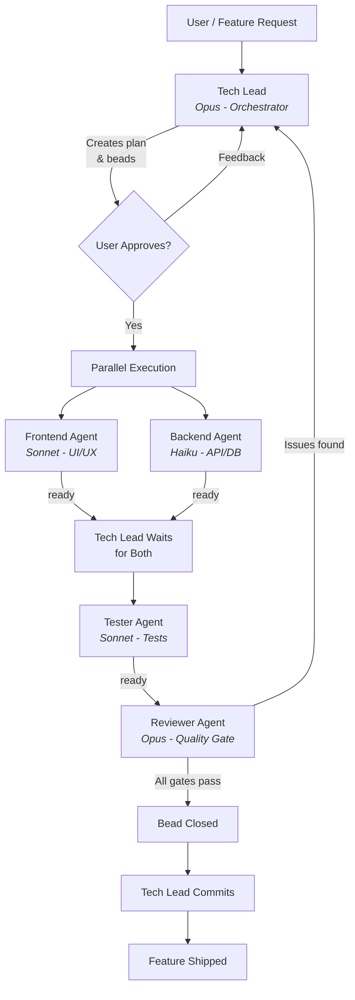

# How We Build Vamsa with Claude Code

Vamsa is developed using an **agentic development workflow** -- a coordinated team of specialized AI agents that take a feature from idea to committed, reviewed, tested code. This page explains the philosophy, the system, and how it differs from traditional AI-assisted coding.

## What is Claude Code?

[Claude Code](https://docs.anthropic.com/en/docs/claude-code) is Anthropic's official CLI for AI-assisted development. It provides a terminal-based interface where Claude can read files, write code, run commands, search the web, and spawn sub-agents -- all within a sandboxed environment tied to your repository.

Unlike IDE plugins that offer inline suggestions, Claude Code operates at the **project level**: it understands your entire codebase, respects your conventions, and can execute multi-step workflows autonomously.

## Why Vamsa Uses It

Vamsa adopted Claude Code for four reasons:

1. **Speed** -- Features that would take days of manual development are delivered in hours through parallel agent execution.
2. **Consistency** -- Every feature follows the same quality gates, testing thresholds, and code patterns because agents are governed by shared rules.
3. **Quality gates** -- A dedicated reviewer agent runs the full quality suite (typecheck, lint, test, build, Docker) before any work is marked complete.
4. **Autonomous development loops** -- Once you describe a feature and approve the plan, the system orchestrates implementation, testing, and review without further intervention.

## The "Agentic Development" Philosophy

Traditional AI coding assistants act as sophisticated autocomplete -- you type, they suggest. Vamsa's approach is fundamentally different. Instead of a single AI helping a single developer, Vamsa uses a **team of specialized agents**, each with a defined role, permissions, and quality responsibilities.

This is not autocomplete. It is a self-governing development team that:

- Analyzes requirements and creates structured task plans
- Delegates work to specialists (frontend, backend, tester)
- Enforces quality gates through a reviewer with final authority
- Resolves issues through coordinated feedback loops
- Commits code only after all gates pass

!!! info "Key Distinction"
    Agents report **"ready"** status, never "complete." Only the Reviewer agent can close a task. This governance model prevents shortcuts and ensures every piece of code passes the full quality suite.

## How It Differs from Copilot and Cursor

| Aspect | Copilot / Cursor | Vamsa's Claude Code System |
|---|---|---|
| **Scope** | Single-file suggestions | Project-wide feature delivery |
| **Agents** | One model, one role | Five specialized agents with distinct roles |
| **Coordination** | None -- developer manages flow | Tech Lead orchestrates all handoffs |
| **Quality** | Developer runs checks manually | Reviewer enforces all gates automatically |
| **Governance** | None | Only reviewer can close tasks; agents have permission boundaries |
| **Autonomy** | Reactive (responds to cursor) | Proactive (runs loops, polls status, resolves issues) |

## System Overview

Vamsa's agentic system consists of five agents, a task management layer (beads), and autonomous loop commands:

### The Five Agents

| Agent | Model | Primary Responsibility |
|---|---|---|
| **Tech Lead** | Opus | Central coordinator -- analyzes, plans, delegates, never implements |
| **Backend** | Haiku | Server functions, Zod schemas, database migrations |
| **Frontend** | Sonnet | React components, pages, forms, design system |
| **Tester** | Sonnet | Unit tests (Vitest), E2E tests (Playwright) |
| **Reviewer** | Opus | Quality gatekeeper -- the only agent that can close tasks |

### Supporting Infrastructure

- **Beads** -- Local-first task management via the `bd` CLI. Tracks epics, child tasks, status, and dependencies.
- **Skills** -- Domain-specific knowledge files (testing patterns, design system tokens) that agents read before working.
- **Loop commands** -- `/techlead-loop` for new features, `/bead-loop` for batch processing existing tasks.

## The Development Lifecycle

A typical feature goes through five phases:

=== "Phase 1: Analysis"

    The Tech Lead analyzes the feature request, explores the codebase for existing patterns, and creates an epic bead with child beads for frontend and backend work. Each bead includes acceptance criteria.

=== "Phase 2: Implementation"

    After user approval, the Tech Lead invokes Frontend and Backend agents **in parallel**. Each agent picks up their bead, implements the work, runs their quality gates, and reports "ready."

=== "Phase 3: Testing"

    Once both implementation agents report ready, the Tech Lead invokes the Tester agent. The tester writes unit tests and E2E tests, verifies coverage thresholds (90%+ statements, 85%+ branches), and reports ready.

=== "Phase 4: Review"

    The Reviewer runs the full quality suite: typecheck, lint, tests, build, dev server startup, Docker build, and Docker container verification. If all pass, the reviewer closes the bead. If issues are found, the Tech Lead reassigns to the responsible agent.

=== "Phase 5: Commit"

    With all beads closed, the Tech Lead commits the changes to git, syncs bead state, and pushes to the remote.

## Next Steps

- **[The Agent Team](agent-team.md)** -- Deep dive into each agent's role, tools, and permissions
- **[Beads Workflow](beads-workflow.md)** -- How task management works with the `bd` CLI
- **[Development Loops](development-loops.md)** -- How autonomous loops drive features from idea to shipped code
