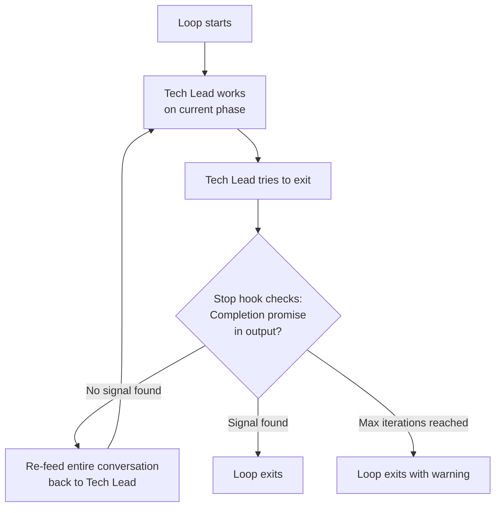

# Autonomous Development Loops

Vamsa provides two loop commands that drive the agent team autonomously. Both use a **stop hook mechanism** to create a persistent feedback loop: the Tech Lead works, tries to exit, and the stop hook re-feeds the conversation until a completion signal is detected.

## How Loops Work: The Stop Hook

Both loops share the same core mechanism. Understanding it is key to understanding autonomous development in Vamsa.



The stop hook is the key innovation. When the Tech Lead finishes a phase and tries to exit, the hook checks for a specific completion promise in the output. If the promise is not found, the hook re-feeds the entire conversation history back to the Tech Lead. The Tech Lead sees all of its previous work -- bead states, agent outputs, file changes -- and autonomously determines the next step.

!!! info "Context Persistence"
    Because the entire conversation is re-fed on each iteration, the Tech Lead retains full context: all modified files, git history, bead states, agent comments, and previous decisions. Nothing is lost between iterations.

---

## `/techlead-loop` -- Feature Delivery Loop

The feature delivery loop takes a **new feature request** from idea to committed code, fully autonomously.

### Usage

```bash
/techlead-loop "Feature description" --max-iterations 50
```

| Parameter | Required | Default | Description |
|---|---|---|---|
| Feature description | Yes | -- | What you want to build |
| `--max-iterations` | No | 50 | Safety limit to prevent infinite loops |
| `--completion-promise` | No | `FEATURE_COMPLETE` | Signal text that allows the loop to exit |

### The Five Phases

=== "Phase 1: Analysis (Iterations 1-2)"

    The Tech Lead analyzes the feature request, explores the codebase, and creates an epic with child beads:

    ```
    Iteration 1:
      Tech Lead: Analyzes feature, creates beads, presents plan
      Tech Lead: Tries to exit

    Stop Hook: No promise found -> re-feed

    Iteration 2:
      Tech Lead: Sees plan from iteration 1
      Tech Lead: Waits for user to say "approved"
    ```

    You review the plan and reply `approved` when ready.

=== "Phase 2: Implementation (Iterations 3-8)"

    The Tech Lead invokes frontend and backend agents in parallel, then polls their status:

    ```
    Iteration 3:
      Tech Lead: Sees "approved"
      Tech Lead: @frontend implement {bead-id}
      Tech Lead: @backend implement {bead-id}
      Tech Lead: Tries to exit

    Iterations 4-7:
      Tech Lead: Polls bd show {bead-id}
      Frontend: in_progress... in_progress... ready
      Backend: in_progress... in_progress... ready

    Iteration 8:
      Tech Lead: Both ready -> proceeds to testing
    ```

=== "Phase 3: Testing (Iterations 9-12)"

    With both implementations ready, the Tech Lead invokes the tester:

    ```
    Iteration 9:
      Tech Lead: @tester write tests for {epic-id}

    Iterations 10-12:
      Tech Lead: Polls tester status
      Tester: Writes unit tests, E2E tests, checks coverage
      Tester: Reports ready with coverage metrics
    ```

=== "Phase 4: Review (Iterations 13-20+)"

    The Tech Lead invokes the reviewer to run the full quality suite:

    ```
    Iteration 13:
      Tech Lead: @reviewer review {epic-id}

    Iteration 16 (Scenario A - All pass):
      Reviewer: Closes beads
      Tech Lead: "Ready to commit?"

    Iteration 16 (Scenario B - Issues found):
      Reviewer: Documents issues in bead comments
      Tech Lead: Identifies responsible agent
      Tech Lead: Reassigns and re-invokes
      Agent: Fixes issues, reports ready
      Tech Lead: @reviewer review (again)
      [Loop continues until all pass]
    ```

=== "Phase 5: Commit (Final iterations)"

    After all beads are closed:

    ```
    Tech Lead: "All beads closed. Ready to commit?"

    User: "commit"

    Tech Lead: git add, commit, push, bd sync
    Tech Lead: <promise>FEATURE_COMPLETE</promise>

    Stop Hook: Promise found -> allows exit
    ```

### User Approval Points

The loop pauses at exactly two points for your input:

1. **Plan approval** -- After the Tech Lead presents the plan, reply `approved`
2. **Commit approval** -- After all gates pass, reply `commit`

Between these points, the loop runs fully autonomously.

### Typical Session

A feature delivery loop typically runs **15-35 iterations** over **4-8 hours**, depending on feature complexity. You interact at only two points (plan approval and commit approval).

---

## `/bead-loop` -- Batch Processing Loop

The bead loop processes **existing beads** autonomously, one at a time. It is designed for batch work -- processing a backlog of tasks, porting features, or closing out a milestone.

### Usage

```bash
/bead-loop --filter "Port" --max-iterations 100
```

| Parameter | Required | Default | Description |
|---|---|---|---|
| `--filter` | No | All open beads | Filter beads by title or ID |
| `--max-iterations` | No | 100 | Safety limit |
| `--completion-promise` | No | `BEAD_LOOP_COMPLETE` | Signal text for loop exit |

### How It Differs

Unlike `/techlead-loop`, the bead loop does not create new beads. Instead, it:

1. Selects existing beads from `bd ready`
2. Enriches each bead with granular implementation details
3. Delegates to the appropriate agents
4. Runs comprehensive quality gates (including Docker build and run)
5. Closes the bead and moves to the next one

### The Eight Phases

=== "Phase 1: Selection"

    ```bash
    bd ready  # List unblocked beads matching filter
    ```

    The Tech Lead picks the highest-priority bead and presents it to you. You reply `proceed` to continue or `skip` to move to the next bead.

=== "Phase 2: Enrichment"

    The Tech Lead explores the codebase (and legacy code if applicable), then updates the bead with detailed implementation steps:

    ```bash
    bd update vamsa-abc --description "$(cat <<'EOF'
    # Detailed Implementation Plan
    ## Legacy Reference
    - Files analyzed: [list]
    ## Implementation Steps
    1. Create route file at X
    2. Create component at Y
    3. Add server function at Z
    ## Testing Requirements
    - Unit tests for validation logic
    - E2E test for form submission
    EOF
    )"
    ```

=== "Phase 3: Delegation"

    Based on the bead type:

    - **Frontend-only:** `@frontend implement {bead-id}`
    - **Backend-only:** `@backend implement {bead-id}`
    - **Full-stack:** Backend first, then frontend (since UI depends on API)

=== "Phase 4: Testing"

    After implementation agents report ready:

    ```
    @tester write tests for {bead-id}
    ```

=== "Phase 5: Review"

    The bead loop uses **comprehensive quality gates** -- the full seven-gate suite including Docker:

    ```bash
    bun run test         # Unit tests
    bun run lint         # ESLint
    bun run typecheck    # TypeScript
    bun run build        # Production build
    bun run dev          # Dev server starts
    docker build         # Container image builds
    docker run           # Container runs and app responds
    ```

=== "Phase 6: Issue Resolution"

    Same as the feature loop: reviewer documents issues, Tech Lead reassigns, agent fixes, reviewer re-validates.

=== "Phase 7: Closure"

    When the reviewer closes the bead, the Tech Lead selects the next bead and returns to Phase 1.

=== "Phase 8: Completion"

    When all filtered beads are closed:

    ```
    <promise>BEAD_LOOP_COMPLETE</promise>
    ```

### User Interaction Points

The bead loop pauses at three points:

1. **Bead selection** -- "Ready to implement {bead}. Reply `proceed` or `skip`"
2. **Issues found** -- "Reviewer found issues. Reply `fix` to continue or `skip` to defer"
3. **All done** -- "All beads complete. Reply `commit` to push changes"

---

## Comparison

| Aspect | `/techlead-loop` | `/bead-loop` |
|---|---|---|
| **Input** | New feature description | Existing beads (via filter) |
| **Bead creation** | Creates new beads | Uses existing beads |
| **Scope** | Single feature | Multiple beads in batch |
| **Enrichment** | Initial design from scratch | Granular details added to existing beads |
| **Quality gates** | Standard (test, lint, build) | Comprehensive (+ Docker build and run) |
| **Typical iterations** | 15-35 | 50-100 (processes multiple beads) |
| **Completion signal** | `FEATURE_COMPLETE` | `BEAD_LOOP_COMPLETE` |
| **Primary use case** | Building a new feature end-to-end | Processing a backlog of tasks |

---

## The Completion Promise Mechanism

Both loops use the same exit mechanism: a **completion promise**. This is a specific string that the Tech Lead outputs when all work is done:

```
<promise>FEATURE_COMPLETE</promise>    # for /techlead-loop
<promise>BEAD_LOOP_COMPLETE</promise>  # for /bead-loop
```

The stop hook checks every Tech Lead output for this string:

- **Found:** The loop exits normally. All work is complete.
- **Not found:** The conversation is re-fed to the Tech Lead for the next iteration.
- **Max iterations reached:** The loop exits with a warning, and you can inspect the state manually.

!!! tip "Safety Limits"
    Always set `--max-iterations` to prevent runaway loops. The recommended values are 50 for feature loops and 100 for bead loops. If a loop hits the limit, check bead status with `bd show` to understand where it stalled.

## Error Recovery

If something goes wrong during a loop:

| Situation | What Happens | What You Do |
|---|---|---|
| Agent gets stuck | Tech Lead detects timeout after 2+ hours | Manually invoke the agent or say "skip" |
| Reviewer finds issues | Tech Lead reassigns to responsible agent automatically | Nothing -- handled autonomously |
| You want to stop | Say `cancel` | Loop exits gracefully; beads remain in current state |
| Max iterations reached | Loop exits with warning | Check `bd show` for state; resume manually |
| Bead is too complex | Say `skip` when prompted | Bead stays open for later; loop continues with next bead |

## Monitoring a Running Loop

While a loop is running, you can check progress at any time:

```bash
bd list --status=open        # See all open beads
bd show vamsa-abc            # Check specific bead status and comments
git status                   # See current file changes
git diff                     # See specific changes
```

You do not need to monitor actively -- the Tech Lead handles all coordination. But these commands are available if you want to observe progress.

## Next Steps

- **[The Agent Team](agent-team.md)** -- The agents that loops orchestrate
- **[Beads Workflow](beads-workflow.md)** -- The task system that loops process
- **[Parallel Patterns](parallel-patterns.md)** -- How loops parallelize work across agents
