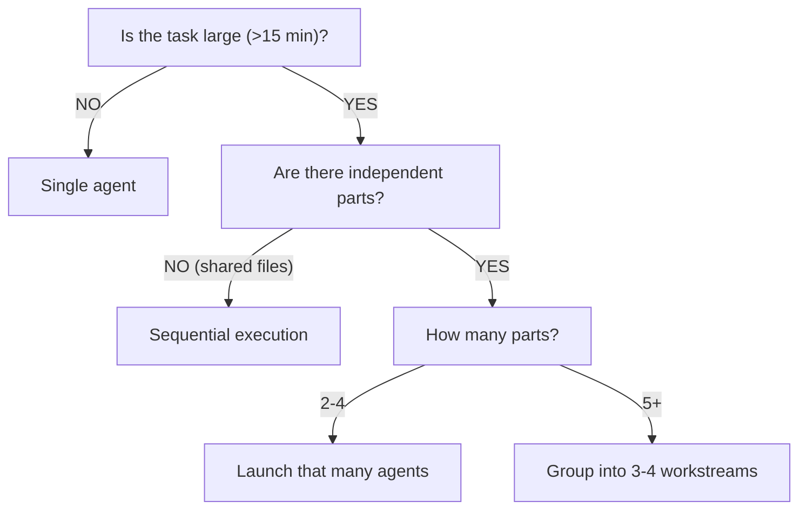
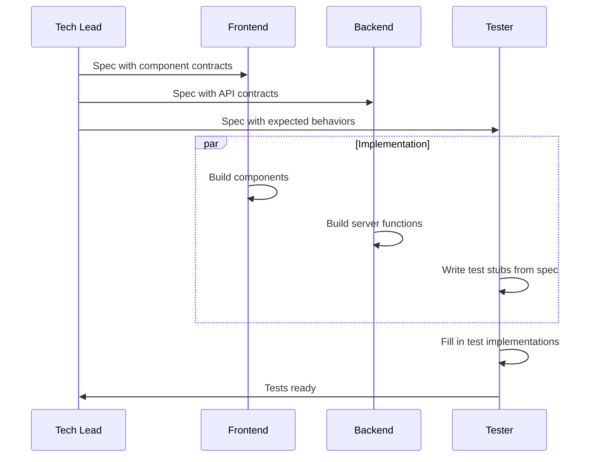
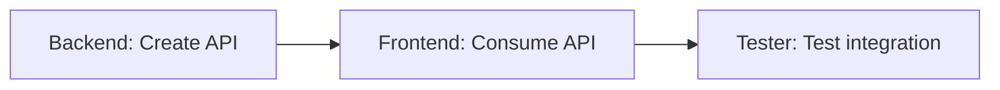

# Parallelization Patterns

When a feature involves independent workstreams -- components that do not share files or have sequential dependencies -- you can launch multiple agents in parallel to dramatically reduce delivery time. This page documents the parallelization strategies used in Vamsa development, when to apply them, and when to avoid them.

---

## Decision Tree

Before parallelizing, run through this decision tree:



The key question is **independence**: can each agent work on its files without conflicting with another agent's changes? If yes, parallelize. If no, serialize.

---

## Pattern 1: Multiple Testers

**When to use:** Improving test coverage across many files that belong to different domains.

**How it works:** Group the files by domain, then launch one tester agent per group. Each tester works on an isolated set of source files and test files.

**Example:** A bead requires test coverage for 9 files across 3 domains:

=== "Workstream A: User Management"
    ```
    - src/server/business/users.ts
    - src/server/business/auth.ts
    - src/server/business/permissions.ts
    ```

=== "Workstream B: Content"
    ```
    - src/server/business/persons.ts
    - src/server/business/relationships.ts
    - src/server/business/families.ts
    ```

=== "Workstream C: Visualization"
    ```
    - src/lib/charts/tree-layout.ts
    - src/lib/charts/pedigree.ts
    - src/lib/charts/timeline.ts
    ```

Launch 3 tester agents simultaneously via multiple Task tool calls in a single message. Each agent receives its file list and writes tests independently. Result: approximately 3x speedup compared to sequential testing.

!!! tip "Grouping strategy"
    Group files that import from each other into the same workstream. If `users.ts` imports from `auth.ts`, they belong together because a tester writing mocks for one needs to understand the other.

---

## Pattern 2: Frontend + Backend + Tester Simultaneously

**When to use:** Feature implementation where the frontend, backend, and test work do not share files.

**How it works:** Three agents work in parallel on completely separate file sets:

| Agent | Works on | Does not touch |
|-------|----------|----------------|
| Frontend | UI components, pages, styles | Server functions, API routes, test files |
| Backend | Server functions, schemas, database queries | UI components, pages, test files |
| Tester | Test files for existing stable code | Source files being actively modified |

```mermaid
gantt
    title Parallel Feature Delivery
    dateFormat X
    axisFormat %s

    section Frontend
    UI components     :0, 10
    Page integration  :10, 15

    section Backend
    Server functions  :0, 8
    Schema updates    :8, 12

    section Tester
    Unit tests        :0, 12
    E2E tests         :12, 15
```



!!! warning "Critical constraint"
    The tester should only write tests for **existing stable code** when running in parallel with implementation agents. If the tester writes tests against APIs that the backend agent is actively changing, the tests will break as soon as the backend changes land.

---

## Pattern 3: Unit Tests + E2E Tests in Parallel

**When to use:** A bead requires both unit test and E2E test coverage, and the two test types target different files.

**How it works:**

| Agent | Focus | Files |
|-------|-------|-------|
| Unit tester | Business logic, server functions, utilities | `packages/lib/src/**/*.test.ts`, `apps/web/tests/**/*.test.ts` |
| E2E tester | User flows, page interactions | `apps/web/e2e/**/*.e2e.ts` |

These agents never conflict because unit tests and E2E tests live in different directories, use different frameworks (Vitest vs Playwright), and test at different levels of abstraction.

---

## Pattern 4: Implementation + Test Writing in Parallel

**When to use:** Only when the specification is clear and detailed enough that the tester can write test stubs from requirements alone, without needing to see the implementation.

**How it works:**

1. The Tech Lead creates a detailed spec with exact function signatures, API contracts, and expected behaviors
2. The frontend agent implements components
3. The backend agent implements server functions
4. The tester writes test stubs from the spec (assertions against the contract, not the implementation)



!!! warning "Prerequisite: detailed spec"
    This pattern fails if the spec is vague. The tester needs exact function names, parameter types, return types, and expected behaviors. Without these, the tester will write tests that do not match the actual implementation, wasting time on rewrites.

---

## When NOT to Parallelize

Not every task benefits from parallelization. Avoid it in these situations:

### Tasks Modifying the Same Files

If two agents edit the same file, their changes will conflict. One agent's work will overwrite the other's. Always serialize work on shared files.

### Sequential Dependencies

When the backend must finish before the frontend can use its APIs, there is a hard dependency. Launching both agents simultaneously means the frontend will write code against APIs that do not exist yet, leading to errors and rework.



In this case, run backend first, then frontend, then tester.

### Small Tasks

Tasks that take less than 5 minutes for a single agent are not worth the coordination overhead of parallelization. The time spent briefing multiple agents and merging their work exceeds the time saved.

### Shared Resource Conflicts

If two agents need to modify the same database table, the same configuration file, or the same shared utility, serialize their work. Examples:

- Two agents both need to add columns to the `persons` table
- Two agents both need to update `drizzle.config.ts`
- Two agents both need to modify a shared Zod schema in `packages/schemas`

---

## Practical Tips

1. **Brief each agent clearly.** Include exact file paths, not vague descriptions. "Write tests for `packages/lib/src/gedcom/parser.ts`" is better than "write some GEDCOM tests."

2. **Set boundaries explicitly.** Tell each agent which files it owns and which files it must not touch.

3. **Use the Tech Lead as coordinator.** The Tech Lead agent spawns parallel tasks, monitors progress, and merges results. Do not try to coordinate parallel agents manually.

4. **Start conservative.** If you are unsure whether tasks are independent, run them sequentially first. You can always parallelize on the next iteration once you understand the file dependencies.

---

## Next Steps

- See how the Tech Lead orchestrates parallel agents in [Development Loops](development-loops.md)
- Understand the review process that validates parallel work in [Quality Gates](quality-gates.md)
- Learn about the agents that participate in parallel work in [The Agent Team](agent-team.md)
