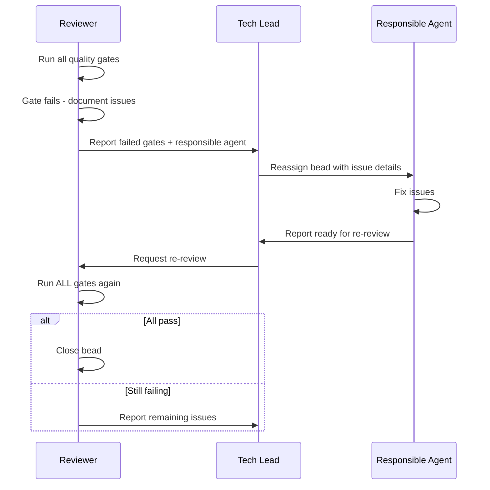

# Quality Gates and Review Process

Vamsa enforces a strict separation between implementation and review: **only the reviewer agent closes beads**. This governance model prevents agents from marking their own work as complete and ensures every feature passes comprehensive quality checks before it ships.

---

## The Core Principle

In autonomous development loops, agents can run for hours without human supervision. Without governance, an agent could close its own bead after passing a subset of checks -- or worse, after writing tests that always pass. The reviewer acts as an independent quality authority, much like code review in traditional development: you do not merge your own pull requests.

!!! info "Why this matters"
    This separation exists because early experiments with self-closing agents revealed a pattern: agents would declare work complete after passing the checks they thought were important, skipping checks they did not consider relevant. The reviewer eliminates this blind spot by running every gate, every time.

---

## Quality Gate Matrix

Different agents run different checks during implementation. The reviewer runs all of them.

| Gate | Backend | Frontend | Tester | Reviewer |
|------|:-------:|:--------:|:------:|:--------:|
| `bun run typecheck` | :material-check: | :material-check: | | :material-check: |
| `bun run lint` | :material-check: | :material-check: | | :material-check: |
| `bun run format:check` | | :material-check: | | :material-check: |
| `bun run build` | :material-check: | :material-check: | | :material-check: |
| `bun run test` | | | :material-check: | :material-check: |
| `bun run test:coverage` | | | :material-check: | :material-check: |
| `bun run dev` (verify startup) | | | | :material-check: |
| `docker build` | | | | :material-check: |
| `docker run` (verify container) | | | | :material-check: |

!!! warning "All gates must pass"
    The reviewer does not close a bead unless every single gate passes. There are no exceptions, no "we'll fix it later" deferrals. If a gate fails, the bead stays open.

---

## The Comprehensive Review Flow

When the tester reports that a bead is ready for review, the reviewer agent takes over and runs through every quality gate systematically.

### Step-by-Step Process

**1. Receive the bead**

The reviewer runs `bd show {bead-id}` to read acceptance criteria and understand what was implemented.

**2. Run all quality gates**

```bash
# Static analysis
bun run typecheck        # No type errors
bun run lint             # No lint errors (warnings acceptable)
bun run format:check     # Code is properly formatted

# Build verification
bun run build            # Production build succeeds

# Test verification
bun run test             # All unit tests pass
bun run test:coverage    # Coverage meets thresholds

# Runtime verification
bun run dev &            # Dev server starts
sleep 15
curl -s http://localhost:3000  # App responds
pkill -f "vinxi" || true

# Container verification
docker build -t vamsa-review -f docker/Dockerfile .
docker run --rm -d -p 3001:3000 --name vamsa-review vamsa-review
sleep 20
curl -s http://localhost:3001  # App responds in container
docker stop vamsa-review
```

**3. Evaluate results**

The reviewer produces a structured report:

```markdown
## Review: {bead-id}

### Quality Gates
| Gate         | Status | Details              |
|--------------|--------|----------------------|
| TypeScript   | PASS   | No errors            |
| Lint         | PASS   | No errors            |
| Format       | PASS   | All files formatted  |
| Build        | PASS   | Built in 12s         |
| Unit Tests   | PASS   | 142 tests, 0 failed  |
| Coverage     | PASS   | 87% lines, 82% branches |
| Dev Server   | PASS   | Responds on :3000    |
| Docker Build | PASS   | Image built          |
| Docker Run   | PASS   | Responds on :3001    |

### Recommendation
**APPROVED - All Gates Pass**
```

**4. Close or reject**

- If ALL gates pass: the reviewer closes the bead with `bd close {bead-id}`
- If ANY gate fails: the reviewer documents issues and the bead stays open

---

## Issue Resolution Flow

When the reviewer finds problems, a structured resolution process ensures issues get fixed by the right agent.



### Agent Responsibility Matrix

When the reviewer finds an issue, it identifies the responsible agent based on the type of failure:

| Failure Type | Responsible Agent |
|--------------|-------------------|
| UI components, pages, styling | Frontend |
| Server functions, schemas, API, database | Backend |
| Tests, coverage gaps | Tester |
| Docker, build configuration | Backend (typically) |

### Issue Documentation

The reviewer documents issues in bead comments with enough detail for the responsible agent to fix them without further investigation:

```bash
bd comment {bead-id} --body "Review FAILED. Issues found:

## Failed Gates
- [ ] bun run typecheck - 3 errors
- [ ] docker build - Dockerfile syntax error

## Details
1. Type error in src/server/business/persons.ts:45 - missing return type
2. Dockerfile line 12 - invalid COPY syntax

## Assignment
- TypeScript error -> @backend
- Docker error -> @backend

Reassign to @backend for fixes."
```

---

## Why Comprehensive Reviews

You might wonder why the reviewer runs Docker checks for a simple UI change, or why it re-runs tests that the tester already passed. Three reasons:

### 1. Integration Effects

A change in one package can break another. The tester might run unit tests for `packages/lib` and see them pass, but the same change could break the build in `apps/web`. Only a full-suite review catches these cross-package effects.

### 2. Environment Differences

Code that works in development might fail in a Docker container due to missing environment variables, different Node.js versions, or filesystem differences. The Docker gates catch deployment issues before they reach production.

### 3. Trust but Verify

Agents are good at their specific tasks but can have blind spots. The frontend agent might not notice a TypeScript error in a file it did not directly modify. The tester might miss a coverage gap in a file that was added late. The reviewer's job is to catch what others missed.

---

## Coverage Thresholds

The reviewer checks that test coverage meets per-package thresholds defined in each package's `vitest.config.ts`:

| Package | Lines | Branches |
|---------|-------|----------|
| `@vamsa/lib` | 80% | 80% |
| `@vamsa/ui` | 95% | 95% |
| `@vamsa/api` | 80% | 70% |
| `@vamsa/schemas` | 90% | 85% |
| `@vamsa/web` | 55% | 65% |

!!! tip "Coverage must be meaningful"
    High coverage numbers from tautological tests (tests that always pass) do not satisfy the reviewer. The testing skill documents anti-patterns that inflate coverage without testing real behavior. See [Skills and Rules](skills-and-rules.md) for details.

---

## Special Cases

### No E2E Tests Yet

If E2E tests do not exist for the feature under review:

- The reviewer notes this in the review report
- Unit test coverage expectations increase (95%+ statements)
- All other gates still apply

### Flaky Tests

If tests are intermittently failing:

- The reviewer runs the test suite 3 times
- If tests pass 2 out of 3 runs, they are noted as flaky but acceptable
- If tests fail 2 out of 3 runs, they are reported as failures

### Docker Issues

Common Docker failures and their resolutions:

- **Missing dependencies**: Update the Dockerfile to include new packages
- **Port conflicts**: Use alternative ports (3001, 3002) for review containers
- **Build context errors**: Check `.dockerignore` for accidentally excluded files

---

## Next Steps

- Understand the agents involved in this process in [The Agent Team](agent-team.md)
- Learn about the rules that guide implementation quality in [Skills and Rules](skills-and-rules.md)
- See how parallel work feeds into the review process in [Parallelization Patterns](parallel-patterns.md)
