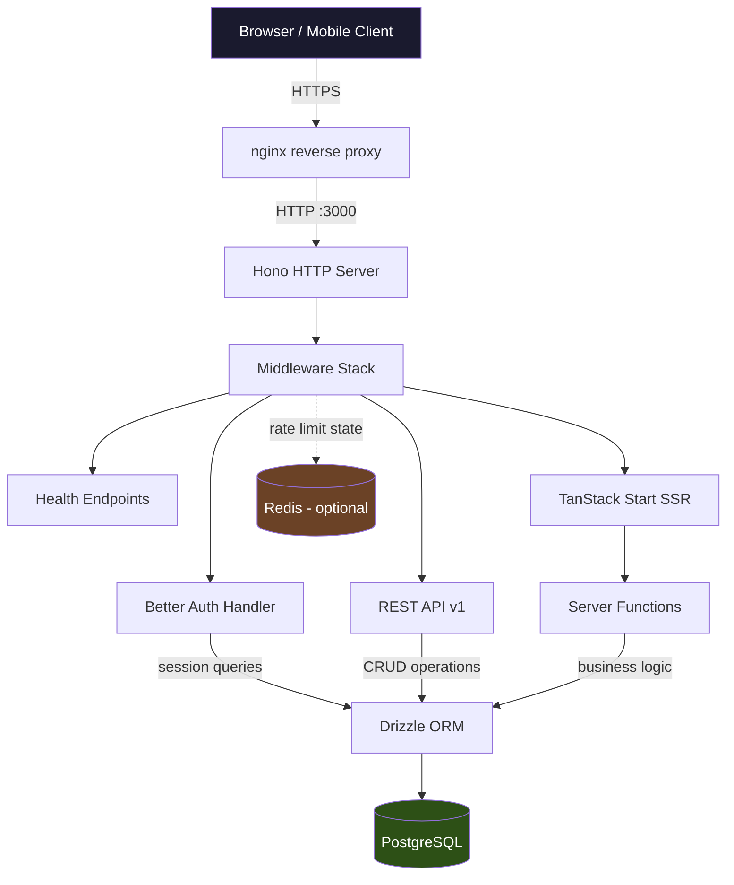
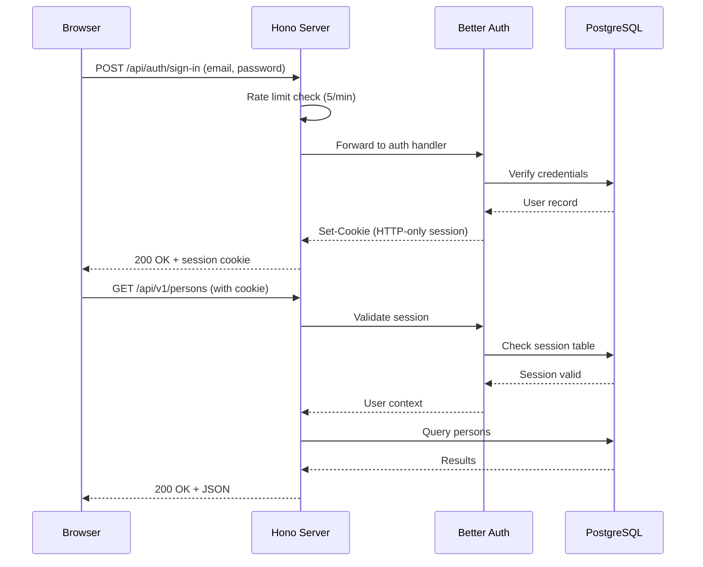

# Architecture Overview

## System Overview

Vamsa is a self-hosted family genealogy application for managing family trees, relationships, historical records, and media. It is designed as a private application -- all content is behind authentication and explicitly blocked from search engine indexing.

The application is built as a Bun monorepo using TanStack Start (React + SSR) for the frontend, Hono as the production HTTP server, PostgreSQL via Drizzle ORM for persistence, and Better Auth for authentication.

## Package Structure

```
vamsa/
  apps/
    web/            # Main application (TanStack Start + Hono server)
    ai/             # Optional AI sidecar service
  packages/
    api/            # Database schema, migrations, queries (Drizzle ORM)
    client/         # API client for external consumers
    lib/            # Shared business logic, GEDCOM parsing, utilities
    query-hooks/    # TanStack Query hooks for data fetching
    schemas/        # Shared Zod validation schemas
    ui/             # Shared UI component library (shadcn/ui based)
```

| Package | Purpose |
|---------|---------|
| `@vamsa/web` | TanStack Start app with SSR, server functions, Hono production server, REST API, and all middleware |
| `@vamsa/ai` | Optional AI sidecar that provides natural-language queries over family data via LLM tool calling |
| `@vamsa/api` | Drizzle ORM schema definitions, migrations, database connection pooling, seed scripts |
| `@vamsa/client` | Typed API client for consuming the REST API from external apps or mobile clients |
| `@vamsa/lib` | Core business logic: GEDCOM import/export, genealogy algorithms, chart calculations, logging (Pino), i18n, server-side auth helpers |
| `@vamsa/query-hooks` | TanStack Query hooks that wrap server functions and REST calls with caching, invalidation, and optimistic updates |
| `@vamsa/schemas` | Zod schemas shared between frontend validation and API request/response validation |
| `@vamsa/ui` | Reusable React components built on shadcn/ui with the Vamsa design system (Fraunces + Source Sans 3 typography, earth tone palette) |

## Request Flow

The following diagram shows how an HTTP request flows through the system in production.



### Middleware Stack

Requests pass through middleware in this order:

1. **Bot Guard** -- blocks known AI scraper user agents
2. **Compression** -- gzip/Brotli response compression
3. **CORS** -- origin validation (strict in production)
4. **CSRF** -- origin header validation for non-safe methods
5. **Secure Headers** -- HSTS, CSP (nonce-based), X-Frame-Options, Permissions-Policy
6. **X-Robots-Tag** -- `noindex, nofollow` on all responses
7. **Telemetry** -- OpenTelemetry HTTP metrics (request duration, counts)
8. **Trusted Proxy** -- validates proxy headers against `TRUSTED_PROXIES` config
9. **Request ID** -- generates or propagates `X-Request-Id` for distributed tracing
10. **ETag** -- conditional caching with route-specific `Cache-Control` policies

After middleware, requests are routed to:

- `/health`, `/readyz` -- health check endpoints (no auth)
- `/health/detail`, `/health/cache`, `/health/telemetry` -- protected metrics endpoints
- `/api/auth/*` -- Better Auth (sign-in, sign-up, OAuth callbacks), with rate limiting
- `/api/v1/*` -- REST API with OpenAPI/Swagger docs
- `/api/v1/vitals` -- Web Vitals ingestion (unauthenticated, validates metric names)
- `/media/*` -- authenticated media file serving
- `/assets/*` -- static file serving (CSS, JS, fonts)
- `*` -- TanStack Start catch-all (SSR pages, server functions)

## Authentication

Vamsa uses [Better Auth](https://better-auth.com) with the following flow:



### Supported Methods

| Method | Configuration |
|--------|---------------|
| Email/Password | Built-in, always available |
| Google OAuth | `GOOGLE_CLIENT_ID` + `GOOGLE_CLIENT_SECRET` |
| Microsoft OAuth | `MICROSOFT_CLIENT_ID` + `MICROSOFT_CLIENT_SECRET` |
| GitHub OAuth | `GITHUB_CLIENT_ID` + `GITHUB_CLIENT_SECRET` |
| Generic OIDC | `OIDC_DISCOVERY_URL` + `OIDC_CLIENT_ID` + `OIDC_CLIENT_SECRET` |

Sessions last 30 days with automatic daily refresh. See [authentication.md](./authentication.md) for detailed setup.

### Rate Limiting

Authentication endpoints are rate limited to prevent brute force attacks:

| Endpoint | Limit |
|----------|-------|
| Sign in | 5 attempts per minute per IP |
| Sign up | 3 attempts per hour per IP |
| Forgot password | 3 attempts per hour per IP |

Rate limit state is stored in memory by default. Set `REDIS_URL` for persistence across server restarts and multi-instance deployments.

## Key Technologies

| Technology | Role |
|-----------|------|
| **Bun** | JavaScript runtime, package manager, bundler |
| **TanStack Start** | Full-stack React framework with SSR and server functions |
| **Hono** | Production HTTP server, middleware, routing |
| **React 19** | UI rendering |
| **Drizzle ORM** | Type-safe SQL queries, schema migrations |
| **PostgreSQL 18** | Primary database |
| **Better Auth** | Authentication (sessions, OAuth, OIDC) |
| **Zod** | Schema validation (shared between client and server) |
| **TanStack Query** | Client-side data fetching, caching, optimistic updates |
| **TanStack Router** | File-based routing with type-safe navigation |
| **Tailwind CSS** | Utility-first styling |
| **shadcn/ui** | Component primitives |
| **Pino** | Structured JSON logging |
| **OpenTelemetry** | Distributed tracing and metrics |
| **Vitest** | Unit and integration testing |
| **Playwright** | End-to-end testing |
| **Redis** | Optional rate limit persistence |

## Observability

### Logging

All server-side code uses Pino structured logging via `@vamsa/lib/logger`:

```typescript
import { logger } from "@vamsa/lib/logger";
logger.info({ userId, action: "login" }, "User logged in");
```

Log level is controlled via `LOG_LEVEL` (default: `info`). Logs are JSON in production for consumption by log aggregators.

### OpenTelemetry

When `OTEL_ENABLED=true`, the server exports:

- **Traces**: HTTP request spans, database query spans
- **Metrics**: Request duration histograms, active connection gauges, Web Vitals (LCP, CLS, INP, FCP, TTFB)

Data is sent to the OTLP endpoint configured in `OTEL_EXPORTER_OTLP_ENDPOINT` (default: `http://localhost:4318`).

A full Grafana + Prometheus + OTEL Collector stack is available in `docker/observability/`:

```bash
bun run observability        # Start the observability stack
bun run observability:down   # Stop it
```

### Health Checks

See the [Monitoring Guide](../operations/monitoring.md) for endpoint details.

## Directory Structure

Key directories within the monorepo:

```
vamsa/
  .claude/              # Claude Code skills and configuration
  apps/
    web/
      server/           # Production server (Hono entry point, middleware, API routes)
        index.ts        # Main server entry -- middleware, health, auth, routing
        api/            # REST API v1 route handlers (Hono + Zod OpenAPI)
        middleware/      # Production middleware (bot-guard, etag, media, metrics, telemetry)
        telemetry.ts    # OpenTelemetry initialization
        metrics.ts      # Web Vitals recording
      src/
        routes/         # TanStack Router file-based routes (pages)
        components/     # React components
        server/
          functions/    # TanStack Start server functions
          middleware/    # Server function middleware (auth, rate limiting, trusted proxy)
      dist/             # Build output (client/ + server/)
      e2e/              # Playwright E2E tests
      tests/            # Unit and integration tests
    ai/                 # AI sidecar service
  packages/
    api/
      src/
        drizzle/
          schema/       # Drizzle table definitions
          migrations/   # SQL migration files
        seed/           # Database seed scripts
    lib/
      src/
        gedcom/         # GEDCOM 5.5 import/export
        charts/         # Family tree chart algorithms
        logger/         # Pino logger configuration
        i18n/           # Internationalization
        server/         # Server-only business logic
    schemas/src/        # Shared Zod schemas
    ui/src/             # shadcn/ui components
  docker/
    docker-compose.yml        # Production deployment
    docker-compose.local.yml  # Development and E2E
    docker-compose.backup.yml # Automated backups
    Dockerfile                # Production app image
    observability/            # Grafana, Prometheus, OTEL Collector
  docs/guides/          # Documentation
  tests/load/           # k6 load test scripts
```

## Related Documentation

- [Operations Guide](../operations/index.md) -- Production deployment and operations
- [API Documentation](./api.md) -- REST API reference
- [Authentication Guide](./authentication.md) -- Auth setup and OAuth configuration
- [Monitoring Guide](../operations/monitoring.md) -- Health checks and observability
